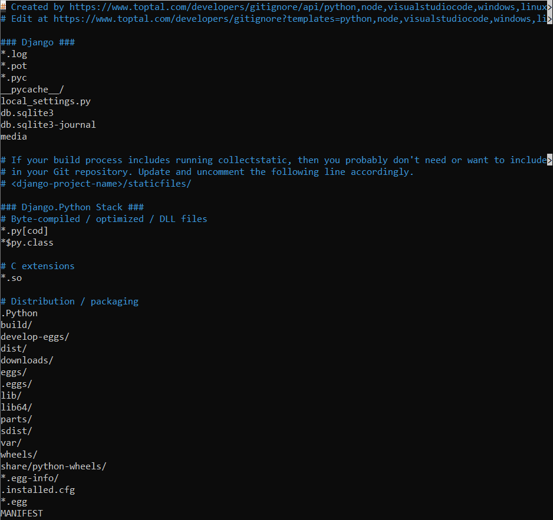

# 🔥 generate-gitignore.sh

A simple, interactive Bash script to generate a `.gitignore` file using the [gitignore.io](https://www.toptal.com/developers/gitignore) API. Supports common programming languages, frameworks, IDEs, and DevOps tools.

## 📦 Features

- Interactive CLI menu with 25+ popular stacks
- Supports custom inputs (e.g., `dotnet,android,unity`)
- Generates a proper `.gitignore` instantly
- Adds optional `.gitignore` description to your `README.md`
- Includes DevOps stacks: Docker, Kubernetes, Terraform, Jenkins, GitHub Actions, etc.

## 🧰 Dependencies
- bash
- curl


## 🖥️ Usage

```bash
chmod +x generate-gitignore.sh
./generate-gitignore.sh
```

## 📘 Example Output

```bash
Select one or more stacks (space-separated numbers), or type 'c' for custom input:
 1) Python
 2) Node
 3) Java
 ...
 c) Custom (type your own comma-separated values)
Your choice: 1 2 14

Generating .gitignore for: python,node,react
.gitignore successfully created.
Do you want to append a note to README.md about .gitignore? (y/n): y
Note added to README.md
```




## ✅ Supported Stacks

- Languages: Python, Node.js, Java, Go, Ruby, C++, JavaScript
- Frameworks: React, Angular, Next.js, Flask, Django, Laravel, Unity
- DevOps Tools: Docker, Kubernetes, Terraform, GitLabCI, GitHubActions, Jenkins, Ansible, Helm
- Platforms: macOS, Windows, Linux
- IDEs: Visual Studio Code

## 🙌 Contributions
Pull requests and new stack suggestions welcome!

## 📄 License
MIT License
